# FRP Web Panel

<p align="center">
  
</p>

<p align="center">
  <strong>🚀 A Modern FRP Intranet Penetration Management Panel</strong>
</p>

<p align="center">
  English | <a href="./README.md">简体中文</a>
</p>

<p align="center">
  
  
  
  
  
</p>

---

## 📖 Introduction

FRP Web Panel is a powerful visual management platform for FRP (Fast Reverse Proxy), providing an intuitive web interface to manage FRP servers, clients, and proxy configurations. It supports multi-server management, real-time traffic monitoring, alert notifications, automatic certificate renewal, and other enterprise-grade features.

## ✨ Features

### 🖥️ Server Management
- Multi FRP server management support
- One-click installation, start, and stop for local servers
- Remote server SSH deployment and management
- Real-time server status monitoring
- Server performance metrics viewing

### 📱 Client Management
- Client registration and token management
- Real-time online status monitoring
- Remote configuration sync and push
- Client daemon process management
- One-click installation script generation
- Batch client updates support

### 🔗 Proxy Configuration
- Support for TCP/UDP/HTTP/HTTPS/STCP/SUDP/XTCP and other proxy types
- Visual proxy rule configuration
- Domain and subdomain configuration
- Automatic DNS synchronization (supports Alibaba Cloud, Tencent Cloud, Cloudflare)
- Bandwidth limit configuration
- Plugin configuration support

### 📊 Real-time Monitoring
- WebSocket real-time data push
- Traffic statistics and trend charts
- Proxy connection count monitoring
- 24-hour traffic trend analysis
- Traffic leaderboard

### 🔐 Certificate Management
- SSL/TLS certificate management
- ACME automatic application and renewal
- Certificate expiration reminders
- Multi-domain certificate support

### 🔔 Alert System
- Traffic threshold alerts
- Client offline alerts
- Custom alert rules
- Email notification support
- Alert recipient management
- Alert history records

### ⚙️ System Settings
- GitHub mirror acceleration configuration
- DNS provider configuration
- Email server configuration
- Alert recipient management
- Check interval configuration

### 📝 Other Features
- JWT secure authentication
- Complete operation audit logs
- Dark/Light theme switching
- Responsive design with mobile support
- IP geolocation identification

## 📸 Screenshots

<details>
<summary>Click to expand screenshots</summary>

### Login Page
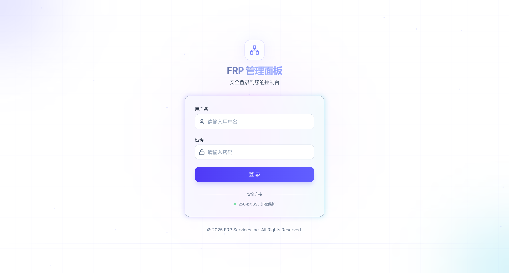

### Dashboard
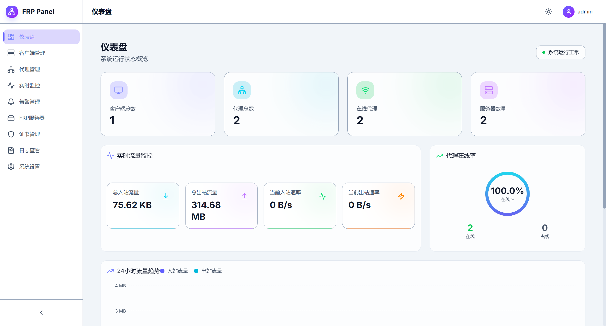

### Server Management
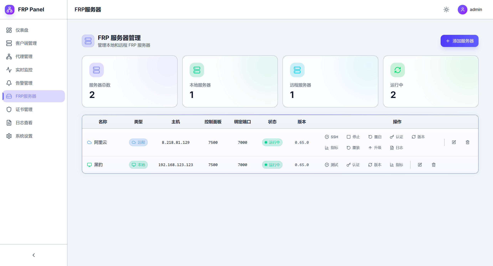
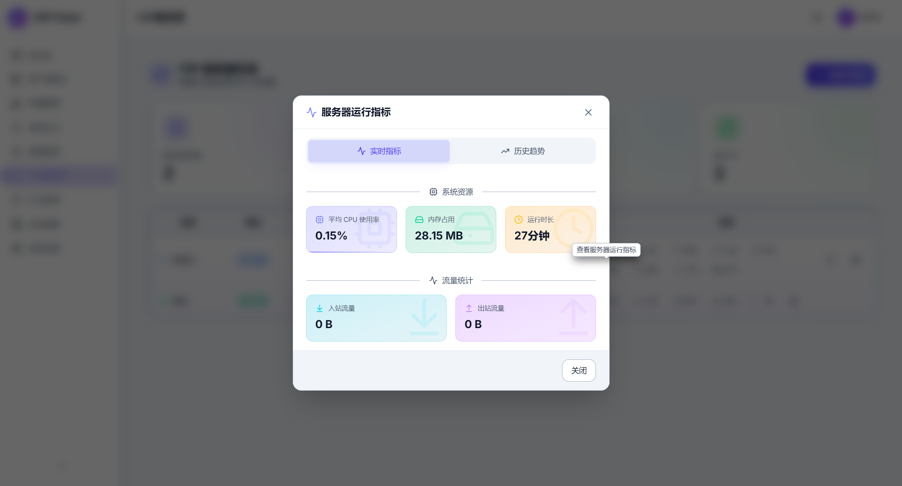
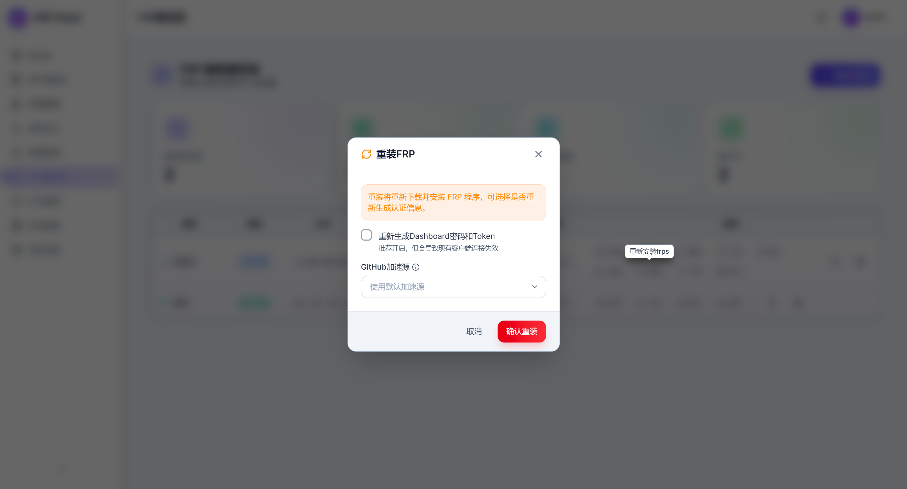

### Client Management
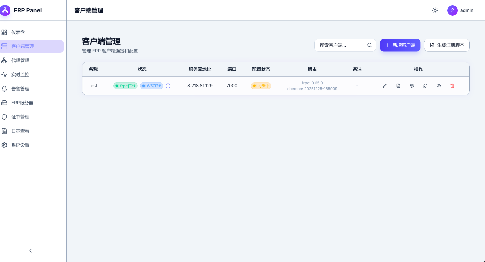
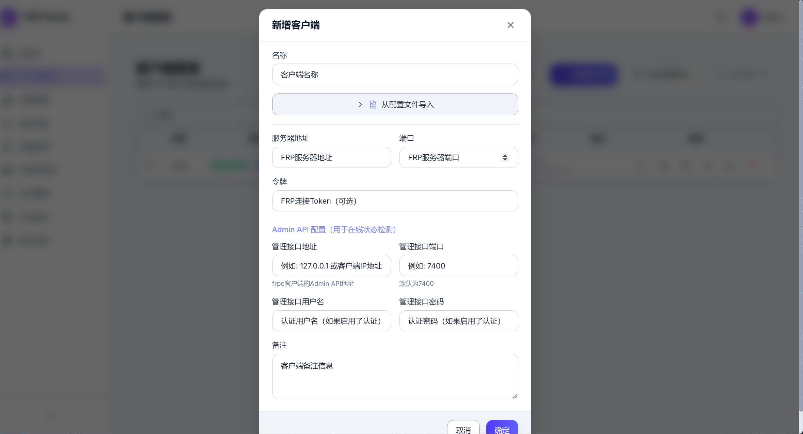


### Proxy Management
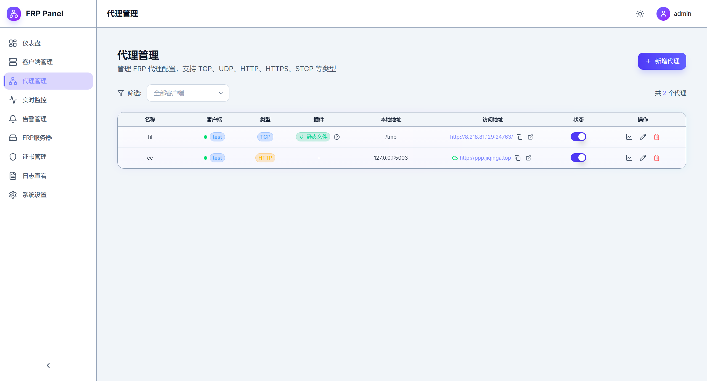
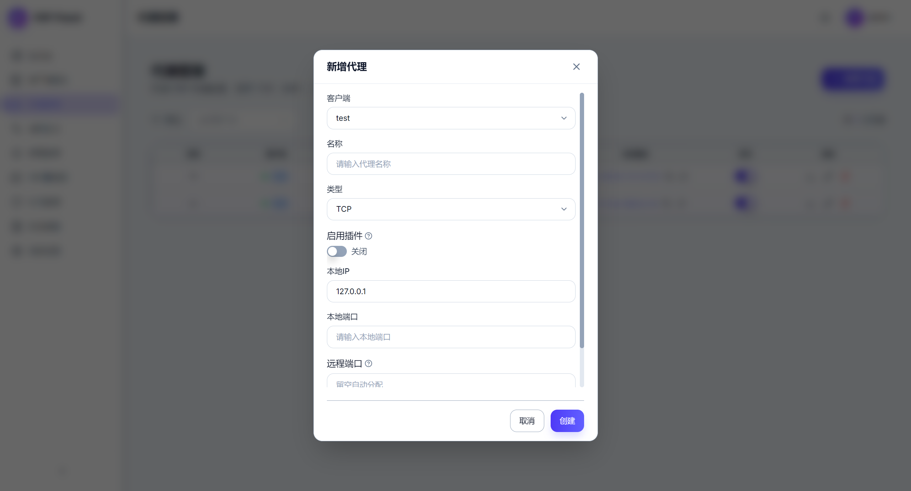

### Real-time Monitoring
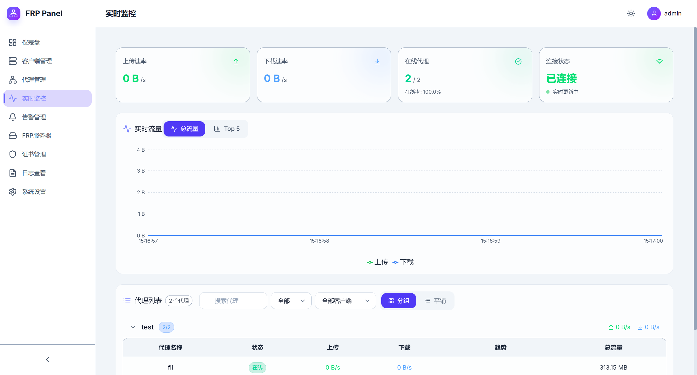

### Certificate Management
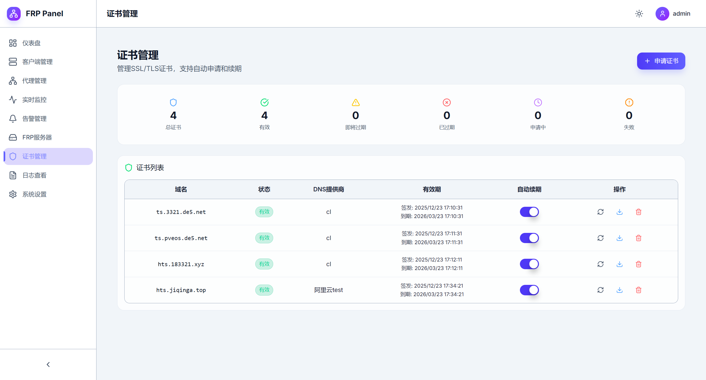

### Alert Management
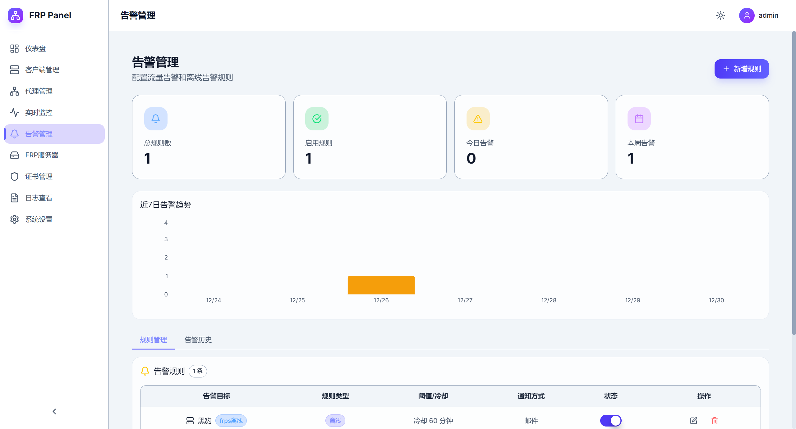

### System Settings
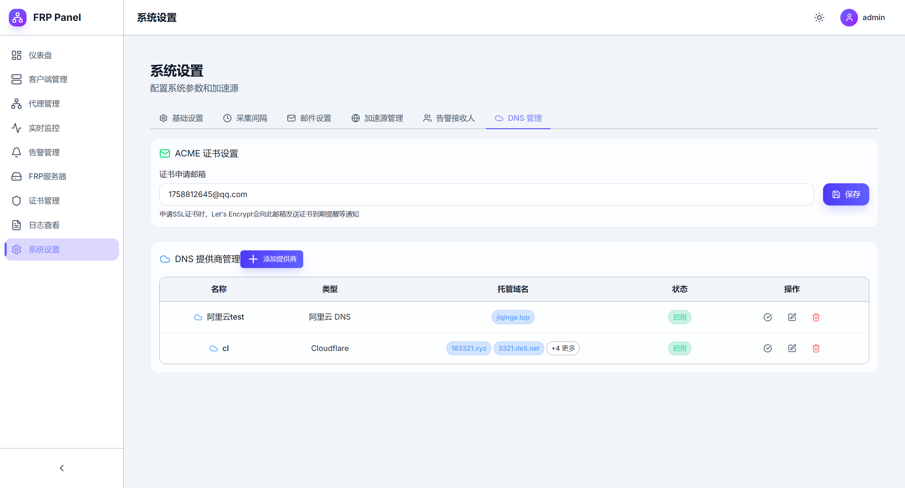
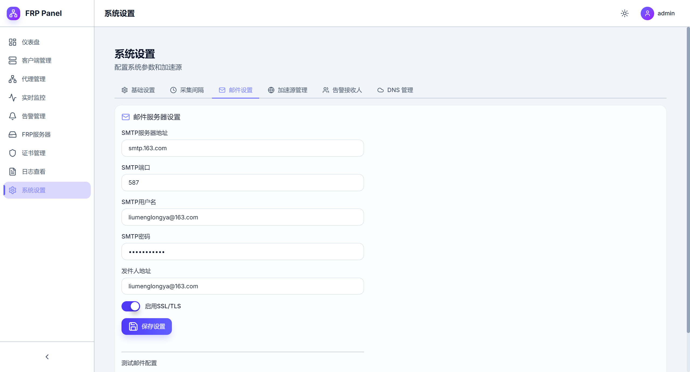

### Operation Logs
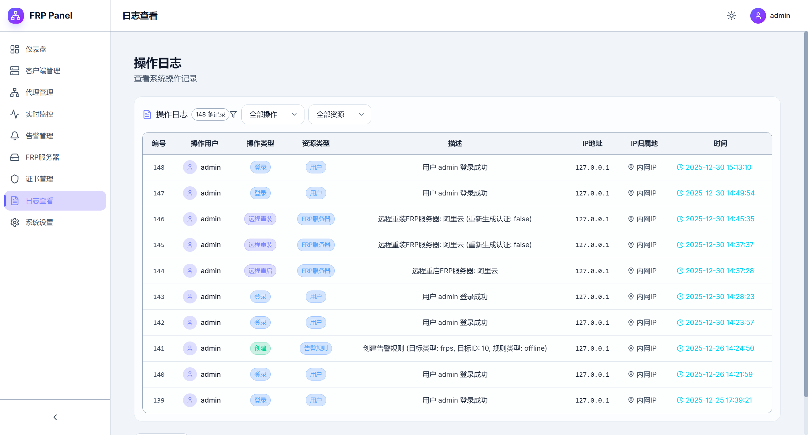

</details>

## 🛠️ Tech Stack

### Backend
| Technology          | Description             |
| ------------------- | ----------------------- |
| Go 1.24+            | Programming Language    |
| Gin                 | Web Framework           |
| GORM                | ORM Framework           |
| SQLite / PostgreSQL | Database                |
| JWT                 | Authentication          |
| WebSocket           | Real-time Communication |
| Swagger             | API Documentation       |

### Frontend
| Technology   | Description          |
| ------------ | -------------------- |
| React 18     | UI Framework         |
| TypeScript   | Type Safety          |
| Vite         | Build Tool           |
| Ant Design   | UI Component Library |
| Zustand      | State Management     |
| React Router | Routing              |
| Recharts     | Chart Library        |
| TailwindCSS  | CSS Framework        |

### Client Daemon
| Technology   | Description               |
| ------------ | ------------------------- |
| Go           | Programming Language      |
| WebSocket    | Server Communication      |
| Process Mgmt | frpc Lifecycle Management |

## 🚀 Quick Start

### Requirements

- Go 1.24+
- Node.js 18+
- pnpm / npm / yarn

### Docker Deployment (Recommended)

#### Option 1: Using Pre-built Image

```bash
# Pull image
docker pull jiqinga/frp-web-panel:latest

# Run container
docker run -d \
  --name frp-web-panel \
  -p 80:80 \
  -v ./data:/app/data \
  --restart unless-stopped \
  jiqinga/frp-web-panel:latest
```

#### Option 2: Using Docker Compose (SQLite)

Create `docker-compose.yml`:

```yaml
version: '3.8'

services:
  frp-web-panel:
    image: jiqinga/frp-web-panel:latest
    container_name: frp-web-panel
    ports:
      - "80:80"      # Web Frontend (Nginx reverse proxy for Backend API)
      # Add port mappings for FRP server ports if needed
      # - "7000:7000"  # frps bind_port
      # - "7500:7500"  # frps dashboard
    volumes:
      - ./data:/app/data       # Data persistence
      - ./configs:/app/configs # Configuration files
    environment:
      - LOG_LEVEL=info
      - GIN_MODE=release
      - TZ=Asia/Shanghai
    restart: unless-stopped
```

Start the service:
```bash
docker-compose up -d
```

#### Option 3: Using Docker Compose (PostgreSQL)

Create `docker-compose-postgres.yml`:

```yaml
version: '3.8'

services:
  frp-web-panel:
    image: jiqinga/frp-web-panel:latest
    container_name: frp-web-panel
    ports:
      - "80:80"
    volumes:
      - ./data:/app/data
      - ./configs:/app/configs
    environment:
      - DATABASE_TYPE=postgres
      - DATABASE_POSTGRES_HOST=postgres
      - DATABASE_POSTGRES_PORT=5432
      - DATABASE_POSTGRES_USER=frp
      - DATABASE_POSTGRES_PASSWORD=frp123
      - DATABASE_POSTGRES_DBNAME=frp_panel
      - JWT_SECRET=your-secret-key-change-in-production
      - SECURITY_ENCRYPTION_KEY=12345678901234567890123456789012
      - LOG_LEVEL=info
      - TZ=Asia/Shanghai
    depends_on:
      postgres:
        condition: service_healthy
    restart: unless-stopped

  postgres:
    image: postgres:15-alpine
    container_name: frp-panel-postgres
    environment:
      - POSTGRES_USER=frp
      - POSTGRES_PASSWORD=frp123
      - POSTGRES_DB=frp_panel
    volumes:
      - postgres_data:/var/lib/postgresql/data
    healthcheck:
      test: ["CMD-SHELL", "pg_isready -U frp -d frp_panel"]
      interval: 5s
      timeout: 5s
      retries: 5
    restart: unless-stopped

volumes:
  postgres_data:
```

Start the service:
```bash
docker-compose -f docker-compose-postgres.yml up -d
```

#### Option 3: Build Image Locally

```bash
# Clone the project
git clone https://github.com/your-username/frp-web-panel.git
cd frp-web-panel

# Build image
docker build -t frp-web-panel:local .

# Run container
docker run -d \
  --name frp-web-panel \
  -p 80:80 \
  -v ./data:/app/data \
  frp-web-panel:local
```

### Manual Deployment

#### 1. Clone the Project

```bash
git clone https://github.com/your-username/frp-web-panel.git
cd frp-web-panel
```

#### 2. Start Backend

```bash
cd backend

# Download dependencies
go mod download

# Copy configuration file
cp configs/config.yaml.example configs/config.yaml

# Edit configuration file
vim configs/config.yaml

# Run service
go run cmd/server/main.go
```

#### 3. Start Frontend

```bash
cd web

# Install dependencies
pnpm install

# Development mode
pnpm dev

# Or build for production
pnpm build
```

#### 4. Access the Panel

```
URL: http://localhost:5173 (development) or http://localhost (production)
Default Username: admin
Default Password: admin123
```

> ⚠️ **Security Notice**: Please change the default password immediately after first login!

## ⚙️ Configuration

### Backend Configuration

Configuration file located at `backend/configs/config.yaml`:

```yaml
server:
  port: 8080              # API service port
  mode: release           # debug / release

log:
  level: info
  format: console

database:
  type: sqlite            # sqlite / postgres
  sqlite:
    path: ./data/frp_panel.db
  postgres:
    host: localhost
    port: 5432
    user: frp
    password: your-password
    dbname: frp_panel

jwt:
  secret: your-secret-key-change-in-production  # JWT secret, must change in production
  expire_hours: 24        # Token expiration time

security:
  encryption_key: '12345678901234567890123456789012'  # 32-character encryption key

frps:
  binary_dir: ./data/frps           # frps binary directory
  config_dir: ./data/frps/configs   # frps configuration directory
  log_dir: ./data/frps/logs         # frps log directory
  default_version: latest
  github_api: https://api.github.com/repos/fatedier/frp

```

### Environment Variables

Configuration can be overridden via environment variables:

```bash
# Server configuration
SERVER_PORT=8080
SERVER_MODE=release
SERVER_PUBLIC_URL=https://your-domain.com

# Database configuration
DB_TYPE=sqlite
DB_SQLITE_PATH=./data/frp_panel.db

# JWT configuration
JWT_SECRET=your-super-secret-key
JWT_EXPIRE_HOURS=24

# Security configuration
SECURITY_ENCRYPTION_KEY=your-32-character-encryption-key
```

### Docker Volume Description

| Path           | Description                           |
| -------------- | ------------------------------------- |
| `/app/data`    | Database, frps binaries, daemon files |
| `/app/configs` | Configuration files                   |

### Port Description

| Port | Description                                        |
| ---- | -------------------------------------------------- |
| 80   | Web Frontend (Nginx reverse proxy for Backend API) |
| 7000 | frps default bind port (manual mapping)            |
| 7500 | frps Dashboard port (manual mapping)               |

## 📁 Project Structure

```
frp-web-panel/
├── backend/                    # Go backend service
│   ├── cmd/server/            # Application entry
│   │   ├── main.go            # Main function
│   │   ├── bootstrap.go       # Initialization
│   │   └── scheduler.go       # Scheduled tasks
│   ├── configs/               # Configuration files
│   ├── data/                  # Runtime data (IP database, etc.)
│   ├── docs/                  # Swagger API documentation
│   ├── internal/              # Internal modules
│   │   ├── config/            # Configuration loading
│   │   ├── container/         # Dependency injection container
│   │   ├── errors/            # Error definitions
│   │   ├── events/            # Event bus
│   │   ├── frp/               # FRP client wrapper
│   │   ├── handler/           # HTTP handlers
│   │   ├── logger/            # Logging module
│   │   ├── middleware/        # Middleware
│   │   ├── model/             # Data models
│   │   ├── repository/        # Data access layer
│   │   ├── router/            # Route definitions
│   │   ├── service/           # Business logic
│   │   ├── util/              # Utility functions
│   │   └── websocket/         # WebSocket handling
│   ├── migrations/            # Database migration scripts
│   └── pkg/                   # Reusable packages
├── web/                       # React frontend application
│   ├── src/
│   │   ├── api/              # API interface wrapper
│   │   ├── assets/           # Static assets
│   │   ├── components/       # Common components
│   │   ├── constants/        # Constants definitions
│   │   ├── hooks/            # Custom Hooks
│   │   ├── pages/            # Page components
│   │   ├── router/           # Route configuration
│   │   ├── store/            # State management
│   │   ├── styles/           # Style files
│   │   ├── types/            # TypeScript types
│   │   └── utils/            # Utility functions
│   └── public/               # Static assets
├── docker/                    # Docker related configuration
│   └── s6-rc.d/              # s6 process management config
├── docs/                      # Project documentation
│   └── screenshots/          # Screenshot files
├── .github/                   # GitHub configuration
├── Dockerfile                 # Docker build file
└── README.md                  # Project documentation
```

## 📖 API Documentation

Access Swagger documentation after starting the backend:

```
http://localhost:8080/swagger/index.html
```

## 🔧 Client Daemon

The client daemon (frpc-daemon-ws) is used to manage remote frpc clients, supporting configuration synchronization, health checks, and automatic updates.

### Features

- WebSocket persistent connection
- Automatic configuration synchronization
- frpc process lifecycle management
- Heartbeat detection
- Automatic update support

### Installation Methods

#### Option 1: Generate Installation Script via Panel

1. Add a client in the panel
2. Click the "Generate Script" button
3. Copy the generated installation script to the target machine and execute

#### Option 2: Manual Installation

1. Download the daemon binary for your platform from the panel
2. Create configuration file `daemon.yaml`:

```yaml
client_id: 1                                              # Client ID
server_url: ws://your-panel-server:8080/api/ws/client-daemon  # Panel WebSocket URL
token: your-client-token                                  # Client token
frpc_path: ./frpc                                         # frpc binary path
frpc_config: ./frpc.toml                                  # frpc configuration file path
frpc_admin_addr: 127.0.0.1                               # frpc admin address
frpc_admin_port: 7400                                     # frpc admin port
heartbeat_sec: 30                                         # Heartbeat interval (seconds)
```

3. Run the daemon:

```bash
./frpc-daemon-ws -c daemon.yaml
```

### Supported Platforms

- Linux (amd64, arm64, arm)
- Windows (amd64, 386)
- macOS (amd64, arm64)

## 🔒 Security Recommendations

1. **Change Default Password**: Change the admin default password immediately after first login
2. **Configure JWT Secret**: Must change `jwt.secret` configuration in production
3. **Configure Encryption Key**: Change `security.encryption_key` to a random 32-character string
4. **Use HTTPS**: Configure SSL/TLS certificates for production environments
5. **Restrict Access**: Use firewall to limit panel access sources
6. **Regular Backups**: Regularly backup the `/app/data` directory

## 🤝 Contributing

Issues and Pull Requests are welcome!

1. Fork this repository
2. Create a feature branch (`git checkout -b feature/AmazingFeature`)
3. Commit your changes (`git commit -m 'Add some AmazingFeature'`)
4. Push to the branch (`git push origin feature/AmazingFeature`)
5. Submit a Pull Request

### Development Environment Setup

```bash
# Backend development
cd backend
go mod download
go run cmd/server/main.go

# Frontend development
cd web
pnpm install
pnpm dev
```

## 📄 License

This project is licensed under the [MIT](LICENSE) License.

## 🙏 Acknowledgments

- [frp](https://github.com/fatedier/frp) - Fast Reverse Proxy
- [Gin](https://github.com/gin-gonic/gin) - Go Web Framework
- [GORM](https://gorm.io/) - Go ORM Framework
- [Ant Design](https://ant.design/) - React UI Component Library
- [Recharts](https://recharts.org/) - React Chart Library

## 📞 Contact

- Submit Issues: [GitHub Issues](https://github.com/your-username/frp-web-panel/issues)

---
